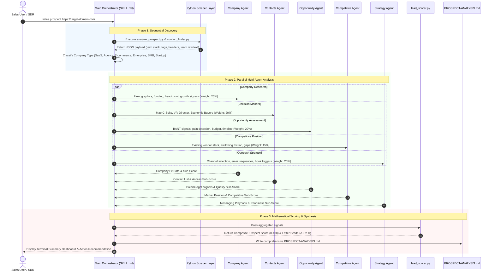

# AI Sales Team for Claude Code: Comprehensive Architecture & Deep Product Analysis

---

## Executive Overview

**AI Sales Team for Claude Code** is an open-source, CLI-native sales intelligence, lead qualification, and outreach automation framework designed specifically to run inside the **Claude Code CLI**.

It enables founders, account executives, sales development representatives (SDRs), and agency teams to conduct instant prospect research, score leads using established sales methodologies (BANT and MEDDIC), map organizational buying committees, draft tailored cold outreach, produce client proposal materials, and render multi-page PDF sales reports—all through simple slash commands in the terminal interface.

---

## 1. System Architecture & High-Level Technical Design

The product is built on a **three-tier hybrid architecture**:
1. **Prompt-Engineered Skill Layer (Markdown Frontmatter + Instructions):** 14 slash-command skills defining user interaction workflows and agent instructions.
2. **Autonomous Multi-Agent Sub-System (5 Subagents):** Specialized agents invoked in parallel for multi-perspective prospect audits.
3. **Deterministic Python Execution Layer (4 Helper Scripts):** Non-LLM scripts handling raw HTML fetching, regex pattern parsing, mathematical lead scoring, and PDF rendering.

```
                               ┌────────────────────────────────────────────────┐
                               │               Claude Code CLI User             │
                               └───────────────────────┬────────────────────────┘
                                                       │ Slash Command (e.g., /sales prospect <url>)
                                                       ▼
                               ┌────────────────────────────────────────────────┐
                               │           Main Orchestrator Skill              │
                               │               (sales/SKILL.md)                 │
                               └───────────────────────┬────────────────────────┘
                                                       │
                 ┌─────────────────────────────────────┼─────────────────────────────────────┐
                 ▼                                     ▼                                     ▼
     ┌───────────────────────┐             ┌───────────────────────┐             ┌───────────────────────┐
     │  13 Modular Sub-Skills│             │ 5 Parallel Subagents  │             │  Deterministic Python │
     │  (Command Execution)  │             │  (/sales prospect)    │             │     Script Layer      │
     ├───────────────────────┤             ├───────────────────────┤             ├───────────────────────┤
     │ • sales-prospect      │             │ • sales-company       │             │ • analyze_prospect.py │
     │ • sales-research      │             │ • sales-contacts      │             │ • contact_finder.py   │
     │ • sales-qualify       │             │ • sales-opportunity   │             │ • lead_scorer.py      │
     │ • sales-contacts      │             │ • sales-competitive   │             │ • generate_pdf_report │
     │ • sales-outreach      │             │ • sales-strategy      │             └───────────┬───────────┘
     │ • sales-followup      │             └───────────┬───────────┘                         │
     │ • sales-prep          │                         │                                     │
     │ • sales-proposal      │                         │                                     │
     │ • sales-objections    │                         │                                     │
     │ • sales-icp           │                         │                                     │
     │ • sales-competitors   │                         │                                     │
     │ • sales-report        │                         │                                     │
     │ • sales-report-pdf    │                         │                                     │
     └───────────┬───────────┘                         │                                     │
                 │                                     │                                     │
                 └─────────────────────────────────────┼─────────────────────────────────────┘
                                                       │
                                                       ▼
                               ┌────────────────────────────────────────────────┐
                               │            Output & Artifact Layer             │
                               │  PROSPECT-ANALYSIS.md | PDF Reports | Files    │
                               └────────────────────────────────────────────────┘
```

---

## 2. Directory Structure & File Taxonomy

```
ai-sales-team-claude/
├── LICENSE                    # MIT License file
├── README.md                  # Detailed documentation and quick-start guide
├── banner.svg                 # SVG banner graphic for repository display
├── install.sh                 # Unix bash installer script
├── uninstall.sh               # Uninstaller script
├── requirements.txt           # Python dependencies (reportlab, beautifulsoup4)
├── sales/                     # Main Orchestrator Skill
│   └── SKILL.md               # Central CLI router and scoring definitions
├── agents/                    # Autonomous Subagents (Used in parallel execution)
│   ├── sales-company.md       # Firmographics & growth signals research agent
│   ├── sales-contacts.md      # Decision-maker discovery & org chart mapping agent
│   ├── sales-opportunity.md   # BANT + MEDDIC qualification & pain scoring agent
│   ├── sales-competitive.md   # Competitor analysis & market positioning agent
│   └── sales-strategy.md      # Outreach messaging & campaign strategy agent
├── scripts/                   # Deterministic Python Tools
│   ├── analyze_prospect.py    # Raw web parser & technology stack detector
│   ├── contact_finder.py      # Executive regex extractor & buying role classifier
│   ├── lead_scorer.py         # Mathematical scoring engine for BANT & MEDDIC
│   └── generate_pdf_report.py # ReportLab engine for rendering multi-page PDF reports
├── skills/                    # Specialized Sub-Skills
│   ├── sales-competitors/     # Competitive intel sub-skill
│   ├── sales-contacts/        # Contact finder sub-skill
│   ├── sales-followup/        # Follow-up sequence generator sub-skill
│   ├── sales-icp/             # Ideal Customer Profile framework sub-skill
│   ├── sales-objections/      # Objection handling playbook sub-skill
│   ├── sales-outreach/        # Cold email sequence generator sub-skill
│   ├── sales-prep/            # Meeting prep brief generator sub-skill
│   ├── sales-proposal/        # Proposal drafting sub-skill
│   ├── sales-prospect/        # Flagship 5-agent audit orchestrator sub-skill
│   ├── sales-qualify/         # Detailed BANT/MEDDIC lead qualifying sub-skill
│   ├── sales-report/          # Markdown sales pipeline compiler sub-skill
│   ├── sales-report-pdf/      # PDF report trigger sub-skill
│   └── sales-research/        # Deep firmographic research sub-skill
└── templates/                 # Markdown Framework Templates
    ├── meeting-prep.md        # Structure for meeting briefs
    ├── objection-playbook.md  # Standard objection response frameworks
    ├── outreach-cold.md       # Cold email templates
    ├── outreach-referral.md   # Referral outreach templates
    ├── outreach-warm.md       # Warm outreach templates
    └── proposal-template.md   # Client proposal layout template
```

---

## 3. Command Reference & Capability Matrix

The suite registers **14 distinct commands** through the primary `sales` skill router:

| Command | Primary Function | Sub-Skill / Script Executed | Target Output File |
| :--- | :--- | :--- | :--- |
| `/sales prospect <url>` | Launches 5 parallel agents for a complete end-to-end audit | `sales-prospect` + 5 Agents + Scripts | `PROSPECT-ANALYSIS.md` |
| `/sales quick <url>` | Fast 60-second snapshot evaluation (No subagents) | `sales` (Direct LLM fetch) | Terminal output (<30 lines) |
| `/sales research <url>` | Deep firmographic & growth signal extraction | `sales-research` + `analyze_prospect.py` | `COMPANY-RESEARCH.md` |
| `/sales qualify <url>` | BANT + MEDDIC lead qualification & risk scoring | `sales-qualify` + `lead_scorer.py` | `LEAD-QUALIFICATION.md` |
| `/sales contacts <url>` | Executive decision-maker & buying role mapping | `sales-contacts` + `contact_finder.py` | `DECISION-MAKERS.md` |
| `/sales outreach <name>` | Multi-touch cold email sequence generation | `sales-outreach` + `templates/outreach-*.md` | `OUTREACH-SEQUENCE.md` |
| `/sales followup <name>` | Post-meeting & non-responsive follow-up emails | `sales-followup` | `FOLLOWUP-SEQUENCE.md` |
| `/sales prep <url>` | Executive meeting brief, question guide, battle card | `sales-prep` + `templates/meeting-prep.md` | `MEETING-PREP.md` |
| `/sales proposal <name>` | Client proposal generator with ROI calculator | `sales-proposal` + `templates/proposal-template.md`| `CLIENT-PROPOSAL.md` |
| `/sales objections <topic>` | Objection handling matrix & counter-messaging | `sales-objections` + `templates/objection-playbook.md`| `OBJECTION-PLAYBOOK.md` |
| `/sales icp <description>` | ICP definition, targeting rules, disqualifiers | `sales-icp` | `IDEAL-CUSTOMER-PROFILE.md` |
| `/sales competitors <url>` | Competitive matrix, feature gaps, battle cards | `sales-competitors` | `COMPETITIVE-INTEL.md` |
| `/sales report` | Aggregates local prospect files into a Markdown report | `sales-report` | `SALES-REPORT.md` |
| `/sales report-pdf` | Compiles pipeline data into a multi-page PDF document | `sales-report-pdf` + `generate_pdf_report.py` | `SALES-REPORT-*.pdf` |

---

## 4. Multi-Agent Orchestration & Workflow Deep-Dive

### The Flagship `/sales prospect` Execution Sequence



---

## 5. Quantitative Lead Qualification & Scoring Model

The system calculates a **Composite Prospect Score** ($0 - 100$) using weighted signals from the 5 parallel subagents, backed by deterministic logic in `scripts/lead_scorer.py`.

### 5.1 Category Weight Distribution

$$\text{Composite Score} = (0.25 \times \text{Fit}) + (0.20 \times \text{Access}) + (0.20 \times \text{Quality}) + (0.15 \times \text{Position}) + (0.20 \times \text{Readiness})$$

| Dimension | Weight | Primary Data Indicators Evaluated |
| :--- | :---: | :--- |
| **Company Fit** | 25% | Revenue range, headcount, funding raised, growth velocity, target industry fit. |
| **Contact Access** | 20% | Number of decision-makers identified, C-suite presence, warm intros/LinkedIn paths. |
| **Opportunity Quality** | 20% | BANT alignment, pain point density in reviews/news, active hiring for key roles. |
| **Competitive Position** | 15% | Replacement ease, dissatisfaction with incumbent solution, explicit tech gaps. |
| **Outreach Readiness** | 20% | Personalization hooks, clarity of value prop trigger, multi-channel viability. |

### 5.2 Lead Grade & Action Assignment

| Score Range | Grade | Market Status | Actionable Directive |
| :--- | :---: | :--- | :--- |
| **90 – 100** | **A+** | Hot Lead | Immediate senior executive multi-channel outreach. High deal probability. |
| **75 – 89** | **A** | Strong Prospect | Invest significant outbound SDR effort. Standard 5-touch email sequence. |
| **60 – 74** | **B** | Qualified Lead | Pursue with standard nurture automation. |
| **40 – 59** | **C** | Lukewarm Lead | Add to automated marketing drip campaign; do not invest heavy manual outbound. |
| **0 – 39** | **D** | Poor Fit | Disqualify immediately to save sales resources. |

---

## 6. Python Execution Layer: Code & Algorithmic Analysis

### 6.1 `scripts/analyze_prospect.py`
A dependency-free Python script utilizing native standard libraries (`urllib.request`, `html.parser.HTMLParser`, `re`, `ssl`).
* **HTML Parser (`TagCollector`):** Minimal DOM parser extracting `<title>`, `<meta>`, `<h1>`-`<h3>` headings, hyperlinks, and embedded JSON-LD (`application/ld+json`) schemas.
* **Technology Signature Matching (`TECH_SIGNATURES`):** Scans raw markup against regex arrays to identify frontend frameworks, CMS engines, analytics tools, and sales integrations:
  ```python
  TECH_SIGNATURES = {
      "WordPress": [r"wp-content", r"wp-includes", r'name="generator".*?WordPress'],
      "Shopify": [r"cdn\.shopify\.com", r"Shopify\.theme"],
      "HubSpot": [r"hs-scripts\.com", r"hbspt", r"hubspot"],
      "Next.js": [r"_next/static", r"__NEXT_DATA__"],
      "Stripe": [r"js\.stripe\.com", r"stripe"],
      "Intercom": [r"intercom", r"widget\.intercom\.io"],
  }
  ```

### 6.2 `scripts/contact_finder.py`
Focuses on identifying leadership personnel from team and corporate pages.
* **Path Discovery (`TEAM_PATHS`):** Automatically probes standard relative routes: `/about`, `/team`, `/leadership`, `/our-team`, `/people`, `/company/team`.
* **Heuristic Classification Engine:** Maps extracted job titles into structured classifications:
  * **Seniority (`SENIORITY_MAP`):** C-Suite, VP, Director, Manager, IC.
  * **Department (`DEPARTMENT_MAP`):** Engineering, Sales, Marketing, Product, Operations, Finance, HR, Legal, Customer Success.
  * **MEDDIC Buying Role (`BUYING_ROLES`):** Economic Buyer (CEO/CFO), Champion (VP/Director), Evaluator (Manager), End User (Engineer/Analyst), Blocker (Legal/Procurement).

### 6.3 `scripts/lead_scorer.py`
Provides mathematical scoring functions for BANT and MEDDIC completeness calculations:
* **`score_budget(signals)`:** Adds points based on funding thresholds ($>\$50M \rightarrow +10$, $>\$10M \rightarrow +8$), employee size, visible pricing, and tech spend.
* **`score_authority(signals)`:** Rewards decision-maker count and C-suite presence.
* **`score_need(signals)`:** Evaluates pain points detected, active job openings, and competitor complaints.
* **`score_timeline(signals)`:** Scores active hiring, recent funding events, and contract renewal windows.

### 6.4 `scripts/generate_pdf_report.py`
A PDF rendering engine built on `reportlab`.
* Creates multi-page sales pipeline executive summary reports.
* Includes custom vector graphics: Score gauges using `reportlab.graphics.shapes.Wedge`, horizontal bar charts (`HorizontalBarChart`), dynamic grade badge chips, formatted summary tables, and page-budgeting logic (`KeepTogether`, `PageBreak`).

---

## 7. Critical Technical Evaluation & Architectural Assessment

### 7.1 Key Strengths & Architectural Victories

1. **Zero Third-Party SaaS API Dependencies:**
   * Operates without requiring paid subscriptions to Apollo, ZoomInfo, Clearbit, or LinkedIn API services. Runs using standard web fetching, search engines, local Python scripts, and LLM inference.
2. **Effective Multi-Agent Parallelization:**
   * Segregates prospect analysis into 5 specialized subagents. This division prevents context window bloat in a single prompt and allows deep multi-perspective evaluation (firmographics, contacts, opportunity, competition, strategy) simultaneously.
3. **Formalized B2B Methodology Integration:**
   * Avoids vague AI summaries by enforcing BANT and MEDDIC frameworks across subagent instructions and scoring scripts.
4. **Deterministic & Probabilistic Hybrid Architecture:**
   * Math operations (BANT calculations, canvas layout coordinates in PDFs) are handled by Python scripts, while qualitative reasoning (company classification, pain synthesis, email writing) is handled by the LLM.

---

### 7.2 Critical Vulnerabilities, Flaws & Failure Modes

#### 🔴 1. HTTP Web Scraping Fragility (Primary Technical Bottleneck)
* **The Vulnerability:** `analyze_prospect.py` and `contact_finder.py` rely on primitive `urllib.request` calls with static User-Agent strings.
* **Failure Mode:** Modern B2B SaaS websites protected by Cloudflare, Akamai, Datadome, or AWS WAF will block these requests with `403 Forbidden` or CAPTCHA challenges.
* **Single-Page Application (SPA) Failure:** JavaScript-rendered sites (React, Vue, Next.js client-side rendering) return empty container HTML tags (`<div id="root"></div>`), resulting in 0 extracted text chunks, 0 contacts, and empty tech stacks.

#### 🔴 2. High Probability of Contact Hallucination
* **The Vulnerability:** Enterprise websites rarely publish direct email addresses or complete team rosters on public HTML pages due to spam prevention.
* **Failure Mode:** When `contact_finder.py` returns incomplete data, downstream LLM subagents (`sales-contacts.md`) attempt to infer or extrapolate contact information from web search snippets. This can lead to hallucinated executive names or unverified email pattern guesses (`first.last@company.com`).

#### 3. Lack of Persistence Layer (No Database or State Tracking)
* **The Vulnerability:** All outputs are saved as unindexed Markdown files (`PROSPECT-ANALYSIS.md`, `COMPANY-RESEARCH.md`) written directly to the local directory.
* **Failure Mode:** Re-running a command overwrites existing analysis files. There is no relational database (SQLite/PostgreSQL) to store historical records, prevent duplicate scraping, track deal progression, or query aggregated pipeline metrics across prospects.

#### 4. High Context Window & Token Consumption Costs
* **The Vulnerability:** Invoking 5 parallel subagents—each reading long web scrape dumps and extensive agent markdown instructions (>600 lines each)—results in high token consumption per run.
* **Failure Mode:** High latency per prospect audit (30–90 seconds) and increased API cost when utilizing pay-per-token model endpoints.

#### 5. Installer Vulnerabilities & Missing Isolation
* **The Vulnerability:** `install.sh` uses simple file copy commands (`cp`) straight into `~/.claude/skills` and `~/.claude/agents`.
* **Failure Mode:** It lacks dependency isolation (no virtual environment creation for Python packages like `reportlab` or `beautifulsoup4`), version control, dependency locking, or atomic uninstall/rollback capabilities.

---

## 8. Summary Ratings & Capability Scorecard

| Dimension | Rating | Technical Assessment |
| :--- | :---: | :--- |
| **CLI User Experience** | ⭐⭐⭐⭐⭐ (5/5) | Excellent command design; simple terminal commands trigger rich visual markdown outputs. |
| **Sales Methodology Depth** | ⭐⭐⭐⭐⭐ (5/5) | Rigorous implementation of BANT, MEDDIC, and ICP scoring models. |
| **Software Architecture** | ⭐⭐⭐☆☆ (3/5) | Clean separation of skills, agents, and scripts; penalized for lack of a persistence store. |
| **Data Scraping Reliability** | ⭐⭐☆☆☆ (2/5) | Highly vulnerable to Cloudflare bot detection and JavaScript SPA hydration issues. |
| **CRM & API Integration** | ⭐⭐☆☆☆ (2/5) | Completely decoupled from CRMs (HubSpot, Salesforce) and outbound email systems. |

---

## 9. Strategic Architectural Improvement Roadmap

To transition this product from a terminal utility into a resilient enterprise-grade sales engine, the following architectural upgrades are recommended:

```
┌────────────────────────────────────────────────────────────────────────────────────────┐
│                        RECOMMENDED ENTERPRISE ARCHITECTURE                             │
└────────────────────────────────────────────────────────────────────────────────────────┘

 [Web Scraper Layer]       [Data Enrichment]       [Persistence Layer]       [Integrations]
 ┌─────────────────┐       ┌─────────────────┐     ┌──────────────────┐      ┌─────────────┐
 │ Playwright /    │  ──►  │ Apollo / Hunter │ ──► │ SQLite Database  │ ──►  │ HubSpot /   │
 │ Firecrawl Proxy │       │ API Fallback    │     │ (~/.claude/db)   │      │ Salesforce  │
 └─────────────────┘       └─────────────────┘     └──────────────────┘      └─────────────┘
```

1. **Headless Scraping & Proxy Integration:**
   * Replace basic `urllib` calls in `analyze_prospect.py` with Playwright / Puppeteer or external scraping services (e.g., Firecrawl, Jina AI) to render dynamic JavaScript SPAs and bypass WAF anti-bot protections.
2. **API Data Enrichment Fallback:**
   * Add optional environment variables for enrichment APIs (Apollo.io, Hunter.io, LinkedIn API) so `contact_finder.py` can fetch verified email addresses and direct phone numbers when public scraping fails.
3. **Local SQLite Persistence Store:**
   * Introduce a local SQLite database (`~/.claude/sales_team.db`) to log company metadata, lead scores, contact lists, and historical prospect audits. This will enable pipeline search commands (e.g., `/sales query --grade=A`) and deduplication.
4. **CRM Sync Capabilities:**
   * Build sync sub-skills (`/sales sync hubspot`, `/sales sync salesforce`) to automatically push qualified leads, scores, and generated outreach sequences into CRM platforms.
