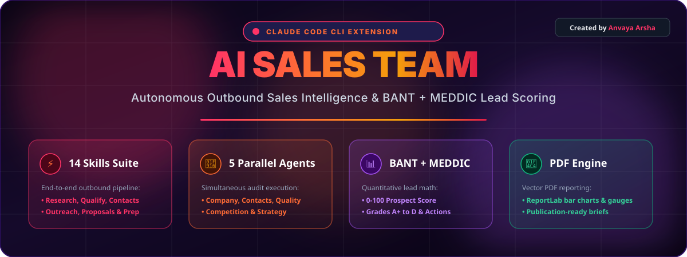

<div align="center">
  

  <br><br>

  <table>
    <tr>
      <td align="center" width="20%">
        <a href="#-quick-start"><b>⚡ INSTALLATION</b></a><br>
        <code>PowerShell &amp; Bash</code>
      </td>
      <td align="center" width="20%">
        <a href="#-14-skill-command-suite"><b>🎛️ COMMANDS</b></a><br>
        <code>14 Skills Ready</code>
      </td>
      <td align="center" width="20%">
        <a href="#-5-parallel-subagents"><b>🤖 MULTI-AGENT</b></a><br>
        <code>5 Parallel Subagents</code>
      </td>
      <td align="center" width="20%">
        <a href="#-lead-qualification-engine-bant--meddic"><b>📊 QUALIFICATION</b></a><br>
        <code>BANT + MEDDIC Math</code>
      </td>
      <td align="center" width="20%">
        <a href="INSTALLATION_AND_USAGE_GUIDE.md"><b>📖 DOCUMENTATION</b></a><br>
        <code>Full Guides &amp; Architecture</code>
      </td>
    </tr>
  </table>

  <br>

  <h1>⚡ AI Sales Team for Claude Code ⚡</h1>
  <p><b>An Autonomous, Multi-Agent Outbound Sales Intelligence Engine Operating Directly Inside Claude Code CLI.</b></p>
  <p><i>Created &amp; Maintained by <b>Anvaya Arsha</b></i></p>

</div>

---

## 🚀 Live Terminal Preview

```text
┌──────────────────────────────────────────────────────────────────────────────┐
│  CLAUDE CODE CLI  ──  AI SALES TEAM (v1.0.0)                                │
└──────────────────────────────────────────────────────────────────────────────┘

> /sales prospect https://acme.com

🌐 Phase 1: Web Scraping & Tech Stack Discovery...
  ✓ Fetched https://acme.com (Homepage, About, Pricing, Team, Careers)
  ✓ Company Type: B2B SaaS Scale-Up
  ✓ Tech Footprint: Next.js, Stripe, Segment, HubSpot, Intercom

🤖 Phase 2: Launching 5 Parallel Subagents...
  [Agent 1/5] ✓ Company Research & Firmographics  ── Fit Score: 88/100
  [Agent 2/5] ✓ Decision Maker Discovery           ── 4 Contacts Found (CEO, CTO, VP Sales)
  [Agent 3/5] ✓ Opportunity Assessment (BANT)       ── Quality Score: 85/100 (High Pain Density)
  [Agent 4/5] ✓ Competitive Intelligence            ── 3 Vendors Mapped (Legacy Switch Trigger)
  [Agent 5/5] ✓ Outreach Strategy & Messaging       ── 5-Touch Outreach Sequence Ready

📊 Phase 3: BANT + MEDDIC Synthesis...

┌──────────────────────────────────────────────────────────────────────────────┐
│  PROSPECT AUDIT SCORE CARD                                                   │
│                                                                              │
│  ██████████████████████████████████████████████░░░░░░░░░░░   87 / 100        │
│                                                                              │
│  GRADE:   A   |  STATUS: Strong Qualified Prospect                           │
│  ACTION:  Invest Senior SDR Outreach Immediately                             │
└──────────────────────────────────────────────────────────────────────────────┘

📁 Full prospect audit saved to PROSPECT-ANALYSIS.md
```

---

## ⚡ Quick Start

### Step 1: Install Claude Code CLI
```bash
npm install -g @anthropic-ai/claude-code
```

### Step 2: Install Python Dependencies
```bash
pip install -r requirements.txt
```

### Step 3: Deploy Skills & Agents

#### 🪟 Windows (PowerShell):
```powershell
powershell -ExecutionPolicy Bypass -File .\install.ps1
```

#### 🐧 macOS / Linux / Git Bash:
```bash
chmod +x install.sh
./install.sh
```

### Step 4: Launch Claude Code
```bash
claude
```

---

## 🎛️ 14-Skill Command Suite

<details open>
<summary><b>🚀 1. Flagship Audit Engine</b></summary>

```bash
/sales prospect <url>   # Full end-to-end sales audit with 5 parallel agents (Saves PROSPECT-ANALYSIS.md)
/sales quick <url>      # Fast 60-second snapshot evaluation directly in terminal
```
</details>

<details>
<summary><b>🔍 2. Deep Research & Qualification</b></summary>

```bash
/sales research <url>    # Deep firmographics, funding signals, tech stack & growth trajectory
/sales qualify <url>     # BANT + MEDDIC lead qualification & risk scoring
/sales contacts <url>    # Executive decision-maker discovery & buying committee mapping
/sales competitors <url> # Competitive matrix, feature gaps & battle-card creation
/sales icp <desc>        # Ideal Customer Profile definition & targeting rules
```
</details>

<details>
<summary><b>✉️ 3. Outreach, Meeting Prep & Deal Execution</b></summary>

```bash
/sales outreach <prospect>   # Multi-touch cold email sequence tailored to prospect pain
/sales followup <prospect>   # Post-meeting & non-responsive follow-up sequence generator
/sales prep <url>            # Executive meeting brief, discovery question guide & battle cards
/sales proposal <client>     # Client proposal generator with ROI calculator
/sales objections <topic>    # Objection handling matrix & counter-messaging playbook
```
</details>

<details>
<summary><b>📊 4. Pipeline Reporting & Analytics</b></summary>

```bash
/sales report       # Aggregates local prospect files into unified Markdown report (SALES-REPORT.md)
/sales report-pdf   # Renders multi-page PDF sales pipeline report (SALES-REPORT-*.pdf)
```
</details>

---

## 📊 Lead Qualification Engine (BANT + MEDDIC)

$$\text{Composite Prospect Score} = (0.25 \times \text{Fit}) + (0.20 \times \text{Access}) + (0.20 \times \text{Quality}) + (0.15 \times \text{Position}) + (0.20 \times \text{Readiness})$$

| Score Range | Grade | Directive |
| :---: | :---: | :--- |
| **90 – 100** | **A+** | Hot Lead — Prioritize immediately for high-touch executive outbound. |
| **75 – 89** | **A** | Strong Prospect — Invest significant SDR effort into 5-touch sequence. |
| **60 – 74** | **B** | Qualified Lead — Pursue with standard nurture approach. |
| **40 – 59** | **C** | Lukewarm — Add to automated marketing drip campaign. |
| **0 – 39** | **D** | Poor Fit — Disqualify to save sales resources. |

---

## ⚔️ Why AI Sales Team? (Comparison Matrix)

| Feature | Manual SDR Research | Enterprise SaaS (ZoomInfo/Apollo) | ⚡ AI Sales Team for Claude |
| :--- | :---: | :---: | :---: |
| **Annual Cost** | \$0 | \$5,000 – \$25,000 / year | **\$0 (Free & Open Source)** |
| **Research Speed** | 30 – 45 mins / lead | Instant static database lookup | **60 Seconds (Live Real-Time Web Scrape)** |
| **Lead Qualification** | Subjective / Manual | Basic headcount filter | **Quantitative BANT + MEDDIC Math** |
| **Multi-Agent Audit** | ❌ No | ❌ No | **✓ 5 Parallel Agents** |
| **Outreach Copy** | Manual drafting | Generic mail merge templates | **Personalized to Tech Stack & Pain** |
| **Vector PDF Reports** | Manual PowerPoint | ❌ No | **Automated ReportLab PDF Engine** |

---

## 🤖 5 Parallel Subagents

```
                  ┌─────────────────────────────────────────┐
                  │          /sales prospect <url>          │
                  └────────────────────┬────────────────────┘
                                       │
      ┌──────────────────┬─────────────┼─────────────┬──────────────────┐
      ▼                  ▼             ▼             ▼                  ▼
┌───────────┐      ┌───────────┐  ┌───────────┐  ┌───────────┐      ┌───────────┐
│  Company  │      │ Contacts  │  │Opportunity│  │Competitive│      │ Strategy  │
│  Agent    │      │  Agent    │  │   Agent   │  │   Agent   │      │   Agent   │
├───────────┤      ├───────────┤  ├───────────┤  ├───────────┤      ├───────────┤
│ Fit: 25%  │      │ Access:20%│  │Quality:20%│  │Position:15│      │Ready: 20% │
└───────────┘      └───────────┘  └───────────┘  └───────────┘      └───────────┘
```

---

## 📖 Complete Documentation

* 📘 **[Installation & User Guide](file:///c:/Users/anvay/Desktop/ai-sales-team-claude-main/ai-sales-team-claude-main/INSTALLATION_AND_USAGE_GUIDE.md):** Detailed setup, CLI invocation, and script execution guide.
* 🏛️ **[Product Architecture & Deep Analysis](file:///c:/Users/anvay/Desktop/ai-sales-team-claude-main/ai-sales-team-claude-main/PRODUCT_ARCHITECTURE_AND_ANALYSIS.md):** Technical design evaluation, scoring formulas, Python codebase analysis, and failure mode mitigation.

---

<div align="center">
  <p>Designed &amp; Developed with ❤️ by <b>Anvaya Arsha</b></p>
  <p>
    <a href="https://github.com/anvaya-arsha/ai-sales-team-claude/issues">Report Bug</a> ·
    <a href="https://github.com/anvaya-arsha/ai-sales-team-claude/issues">Request Feature</a>
  </p>
</div>
