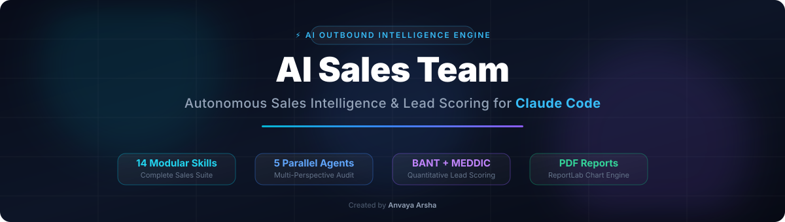

<p align="center">
  
</p>

<p align="center">
  <a href="#-quick-start"></a>
  <a href="#-interactive-command-hub"></a>
  <a href="#-multi-agent-architecture"></a>
  <a href="#-quantitative-scoring-engine"></a>
  <a href="INSTALLATION_AND_USAGE_GUIDE.md"></a>
</p>

<blockquote align="center">
  <h3>⚡ Your AI-Powered Outbound Sales Machine — Operating Directly Inside Claude Code CLI ⚡</h3>
  <p>Research any company, discover executive buying committees, score leads with BANT + MEDDIC, generate hyper-personalized cold outreach sequences, prepare for executive meetings, and render publication-ready PDF sales reports — <strong>all from your terminal.</strong></p>
</blockquote>

---

## 📸 Live Terminal Preview

```text
> /sales prospect https://acme.com

🚀 Launching 5 Parallel Subagents...
  [1/5] ✓ Company Research & Firmographics  ── Fit Score: 88/100  (SaaS / Scale-up)
  [2/5] ✓ Decision Maker Discovery           ── 4 Contacts Found  (CEO, CTO, VP Sales)
  [3/5] ✓ Opportunity Assessment (BANT)       ── Quality Score: 85/100 (Pain Density High)
  [4/5] ✓ Competitive Intelligence            ── 3 Vendors Mapped (Legacy Replacement)
  [5/5] ✓ Outreach Strategy & Messaging       ── Multi-Touch Email Sequence Prepared

┌────────────────────────────────────────────────────────────────────────┐
│  PROSPECT AUDIT SCORE CARD                                             │
│                                                                        │
│  ██████████████████████████████████████████████░░░░░░░   87 / 100      │
│                                                                        │
│  GRADE:  A   |  STATUS: Strong Qualified Prospect                      │
│  ACTION:  Invest Senior SDR Outreach Immediately                       │
└────────────────────────────────────────────────────────────────────────┘

📁 Full prospect audit saved to PROSPECT-ANALYSIS.md
```

---

## ⚡ Quick Start (1-Minute Installation)

### 1. Install Claude Code CLI
```bash
npm install -g @anthropic-ai/claude-code
```

### 2. Install Python Dependencies
```bash
pip install -r requirements.txt
```

### 3. Deploy Skills & Agents
<details open>
<summary><strong>🪟 Windows (PowerShell)</strong></summary>

```powershell
powershell -ExecutionPolicy Bypass -File .\install.ps1
```
</details>

<details>
<summary><strong>🐧 macOS / Linux / Git Bash</strong></summary>

```bash
chmod +x install.sh
./install.sh
```
</details>

### 4. Launch Product
```bash
claude
```

---

## 🎛️ Interactive Command Hub

Click any category below to reveal specific command usage and output files:

<details open>
<summary><strong>🚀 Flagship Prospect Audit Engine</strong></summary>

| Command | Description | Primary Deliverable |
| :--- | :--- | :--- |
| `/sales prospect <url>` | Launches 5 parallel subagents for a complete multi-perspective sales audit | `PROSPECT-ANALYSIS.md` |
| `/sales quick <url>` | Fast 60-second snapshot evaluation without launching subagents | Terminal Summary (<30 lines) |

```bash
# Example:
/sales prospect https://acme.com
```
</details>

<details>
<summary><strong>🔍 Deep Prospect Research & Lead Qualification</strong></summary>

| Command | Description | Primary Deliverable |
| :--- | :--- | :--- |
| `/sales research <url>` | Deep firmographics, funding signals, tech stack detection & growth trajectory | `COMPANY-RESEARCH.md` |
| `/sales qualify <url>` | Rigorous lead qualification using BANT + MEDDIC scoring frameworks | `LEAD-QUALIFICATION.md` |
| `/sales contacts <url>` | Executive decision-maker discovery, org mapping & buying role identification | `DECISION-MAKERS.md` |
| `/sales competitors <url>` | Competitive matrix, feature gap detection & battle-card creation | `COMPETITIVE-INTEL.md` |
| `/sales icp <description>` | Builds Ideal Customer Profile rules, targeting criteria & disqualifiers | `IDEAL-CUSTOMER-PROFILE.md` |

```bash
# Examples:
/sales qualify https://acme.com
/sales contacts https://acme.com
```
</details>

<details>
<summary><strong>✉️ Outreach, Meeting Prep & Deal Execution</strong></summary>

| Command | Description | Primary Deliverable |
| :--- | :--- | :--- |
| `/sales outreach <prospect>` | Multi-touch cold email sequence tailored to prospect pain & tech stack | `OUTREACH-SEQUENCE.md` |
| `/sales followup <prospect>` | Post-meeting & non-responsive follow-up sequence generator | `FOLLOWUP-SEQUENCE.md` |
| `/sales prep <url>` | Executive meeting prep brief, discovery question guide & objection battle cards | `MEETING-PREP.md` |
| `/sales proposal <client>` | Client proposal generator with ROI model & milestone timelines | `CLIENT-PROPOSAL.md` |
| `/sales objections <topic>` | Objection handling matrix & counter-messaging playbook | `OBJECTION-PLAYBOOK.md` |

```bash
# Examples:
/sales outreach "Acme Corp"
/sales prep https://acme.com
```
</details>

<details>
<summary><strong>📊 Pipeline Reporting & Analytics</strong></summary>

| Command | Description | Primary Deliverable |
| :--- | :--- | :--- |
| `/sales report` | Aggregates all local prospect files into a unified pipeline report (Markdown) | `SALES-REPORT.md` |
| `/sales report-pdf` | Compiles pipeline data into a publication-ready PDF document with ReportLab charts | `SALES-REPORT-*.pdf` |

```bash
# Examples:
/sales report-pdf
```
</details>

---

## 🏗️ Multi-Agent Architecture

```
                          ┌──────────────────────────┐
                          │     /sales prospect      │
                          │      (Orchestrator)      │
                          └────────────┬─────────────┘
                                       │
                    ┌──────────────────┼──────────────────┐
                    ▼                  ▼                   ▼
          ┌─────────────┐    ┌─────────────────┐    ┌──────────────┐
          │   PHASE 1   │    │     PHASE 2     │    │   PHASE 3    │
          │  Discovery  │    │ Parallel Agents │    │  Synthesis   │
          └──────┬──────┘    └────────┬────────┘    └──────┬───────┘
                 │                    │                    │
                 ▼                    ▼                    ▼
          ┌─────────────┐    ┌────────────────┐    ┌──────────────┐
          │ Fetch pages │    │ 5 Agents run   │    │ Aggregated   │
          │ Extract text│    │ simultaneously │    │ Score (0-100)│
          │ Detect type │    │                │    │ Action Plan  │
          │ Run scripts │    │                │    │ Output file  │
          └─────────────┘    └───────┬────────┘    └──────────────┘
                                     │
                 ┌───────────────────┼───────────────────┐
                 │                   │                   │
        ┌────────────────┐   ┌──────────────┐    ┌───────────────┐
        │  Sales Company │   │  Contacts    │    │ Opportunity   │
        │  Research      │   │  Finder      │    │ Scoring       │
        │  (Fit: 25%)    │   │  (Access:20%)│    │ (Quality: 20%)│
        └────────────────┘   └──────────────┘    └───────────────┘
        ┌────────────────┐   ┌──────────────┐
        │ Competitive    │   │ Outreach     │
        │ Analysis       │   │ Strategy     │
        │ (Position:15%) │   │ (Ready: 20%) │
        └────────────────┘   └──────────────┘
```

---

## 📊 Quantitative Lead Scoring Engine (BANT + MEDDIC)

The system calculates a **Composite Prospect Score** ($0 - 100$) using weighted signals from the 5 subagents:

$$\text{Composite Score} = (0.25 \times \text{Fit}) + (0.20 \times \text{Access}) + (0.20 \times \text{Quality}) + (0.15 \times \text{Position}) + (0.20 \times \text{Readiness})$$

| Score Range | Grade | Action Directive |
| :---: | :---: | :--- |
| **90 – 100** | **A+** | Hot Lead — Prioritize immediately for high-touch executive outbound. |
| **75 – 89** | **A** | Strong Prospect — Invest significant SDR effort into 5-touch sequence. |
| **60 – 74** | **B** | Qualified Lead — Pursue with standard nurture approach. |
| **40 – 59** | **C** | Lukewarm — Add to automated marketing drip campaign. |
| **0 – 39** | **D** | Poor Fit — Disqualify to protect sales resources. |

---

## 📚 Comprehensive Documentation

Deep-dive architectural reviews, technical benchmarks, and complete step-by-step guides are available in the repository documentation:

* 📖 **[Installation & User Guide](file:///c:/Users/anvay/Desktop/ai-sales-team-claude-main/ai-sales-team-claude-main/INSTALLATION_AND_USAGE_GUIDE.md):** Complete setup, CLI invocation, and script running instructions.
* 🏛️ **[Product Architecture & Deep Analysis](file:///c:/Users/anvay/Desktop/ai-sales-team-claude-main/ai-sales-team-claude-main/PRODUCT_ARCHITECTURE_AND_ANALYSIS.md):** Technical evaluation, algorithmic details, scoring weight formulas, failure modes, and technical roadmap.

---

<p align="center">
  Developed with ❤️ by <strong>Anvaya Arsha</strong>
  <br><br>
  <a href="https://github.com/anvaya-arsha/ai-sales-team-claude/issues">Report Bug</a> ·
  <a href="https://github.com/anvaya-arsha/ai-sales-team-claude/issues">Request Feature</a>
</p>
